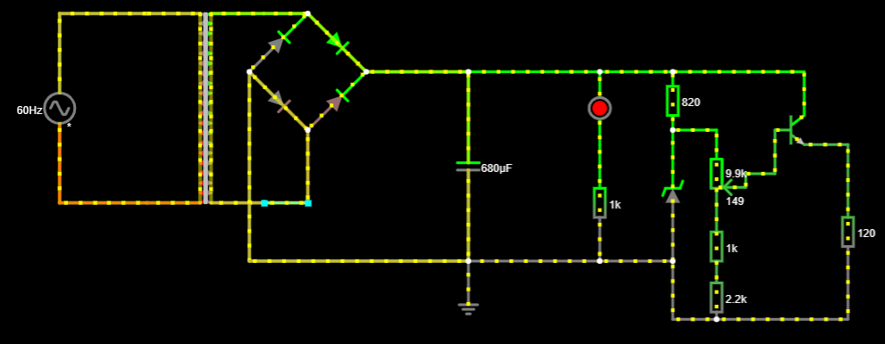
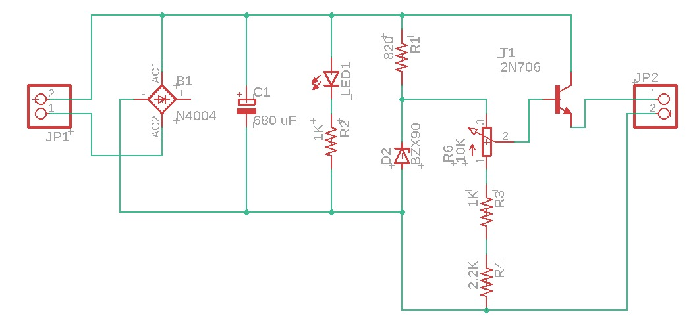
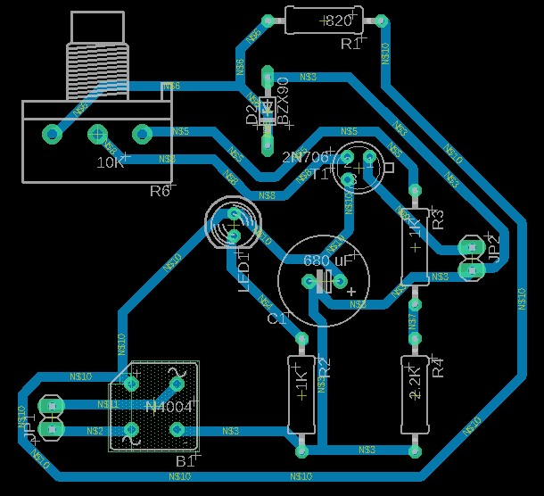

# Fonte Variável

## Objetivo
O objetivo do projeto é criar uma fonte de tensão variável entre 3v e 12v

## Preços (Julho de 2022)
| Comando | Descrição |
| --- | --- |
| 1xCapacitor 680 uF | R$5,70 |
| 2xResistores 1KΩ | R$ 0,07 cada |
| 1xResistor 820Ω | R$ 0,07 |
| 1xResistor 2.2KΩ | R$ 0,06 |
| 1xDiodo Zener 13V | R$0,48 |
| 4xDiodos 1N4004 | R$0,20 cada |
| 1xTransistor BC337-40 | R$ 0,69 |
| 1xPotenciômetro 10KΩ | R$ 7,00 |
| 1xLED 5MM | R$ 0,50 |

## Materiais usados
### Transformador
Foi utilizado para transformar uma entrada AC de 180v de entrada para 23.98v AC na saída.

Cálculo para a tensão RMS:
Vrms = Vmax/√2 = 179.8/√2 = 127.28v.

Cálculo para a tensão transformada:
Vtr/Vent = (N1 / N2)
Vtr/179.8 = 1/7.5
Vtr = 24v. No entanto, o valor real é 23.98v.

### Diodo
Foram usados 4 diodos 1N4004 para retificar a corrente AC para uma corrente DC.

Cálculo do consumo dos 4 idodos:
Vcons = Vantes - Vdepois = 23.98v - 22.57v = 1.40v;

### Capacitor
Foi usado um capacitor 680µF para filtrar a corrente que sai da ponte de diodo.

Cálculo do ripple:

Consideraremos um ripple máximo de 10%. Então:
Vs = 22.9v
RIPPLE = Vs / 10 = Vs / 2*f * C * R = I / 2*f*C = 2.29
Isolando a capacitância,
C = 101.67mA / 2 * 60 * 2.29 ≅ 370µF (foi usado um capacitor maior por causa da indisponibilidade desse valor, então o ripple é menor).

### Resistor
Foram usados 2 resistores de 1KΩ, 1 de 820Ω e 1 de 2.2kΩ.

### Diodo Zenner
Foi usado um diodo zenner com tensão de ruptura de 13v para limitar a tensão de saída da fonte em até 13v.

### Transistor e Potenciometro
O transistor 1N4004, em conjunto com o protenciômetro de 10kΩ, faz a parte da regulagem da tensão de saída da fonte. Para a nossa fonte, a tensão mínima deve ser de pelo menos 3v; e a tensão máxima, de pelo menos 12v.

## Conclusão
No final da montagem, conseguimos montar uma fonte funcional que consegue regular a tensão entre 2.8v e 12.7v.

## Circuito no Falstad

## Circuito no Eagle

## Vídeo apresentando a fonte
https://youtu.be/RwTchMkjonU
