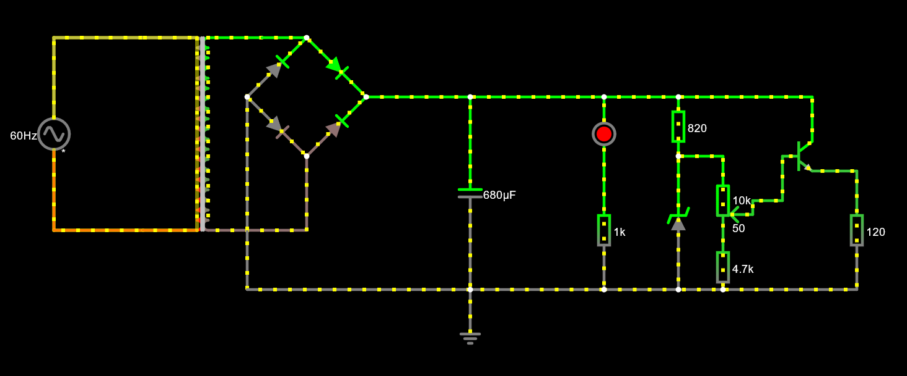

# Fonte Variável

## Objetivo
O objetivo do projeto é criar uma fonte de tensão variável entre 3v e 12v.

## Materiais usados
### Transformador
Foi utilizado para transformar uma entrada AC de 180v de entrada para 17.98v AC na saída.

Cálculo para a tensão RMS:
Vrms = Vmax/√2 = 179.8/√2 = 127.28v.

Cálculo para a tensão transformada:
Vtr/Vent = (N1 / N2)
Vtr/179.8 = 1/10
Vtr = 18v. No entanto, o valor real é 17.98v.

### Diodo
Foram usados 4 diodos 1N4004 para retificar a corrente AC para uma corrente DC.

Cálculo do consumo dos 4 idodos:
Vcons = Vantes - Vdepois = 17.98v - 16.58v = 1.40v = 2 * 0.7v;

### Capacitor
Foi usado um capacitor 680µF para filtrar a corrente que sai da ponte de diodo.

Cálculo do ripple:

RIPPLE =  Vs / 2*f * C * R = I / 2*f*C

C = 100mA / 2 * 60 * 1.658V ≅ 502,6µF (foi usado um capacitor maior, então o ripple é menor).

### Resistor
Foram usados 1 resistor de 1KΩ, 1 de 820Ω e 1 de 4.7KΩ.

### Diodo Zenner
Foi usado um diodo zenner com tensão de ruptura de 13v para regular a tensão de saída da fonte.

### Transistor
200mA

### Potenciometro
O pontenciômetro de 10kΩ foi utilizado para variar a tensão entre os 3v e 12v.

## Conclusão

## Circuito no Falstad

